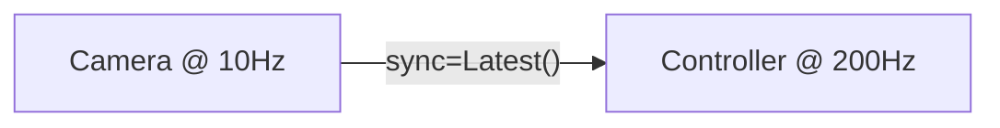

# Temporal Model: Clocks, Adapters & Sync Policies

This guide explains the **time + event model** used by the Retriever runtime. It covers **Sync Policies** (how to align data), **Adapters** (sampling strategies), and **Clocks** (execution triggers).

## Overview

In a multi-rate dataflow system, nodes run at different frequencies. A camera might produce images at 10Hz, while a robot controller expects commands at 200Hz.

- **Clocks** decide *when* a node runs.
- **Adapters** bridge rate mismatches by defining *how* to sample data from input buffers at the execution time `now`.



---

## 1. TL;DR Mental Model

- Every **port** behaves like a timestamped **event stream**.
- The runtime stores a finite **event buffer** per port: `retriever.flow.types.EventBuffer[T] = list[tuple[float, T]]`.
- Dataset/export contracts use the separate `retriever.data_spec.EventBuffer` layer.
- An **executor step** happens at a specific wall-clock time `now`.
- An **Adapter** samples the buffer at `now` (e.g., pick latest, interpolate, aggregate).
- A **Clock** triggers the step (e.g., periodic Rate, event-driven Trigger).

### FRP Core Concepts

Retriever implements a pragmatic variation of Functional Reactive Programming:

- **`EventStream[T]`**: A sequence of distinct events `(timestamp, value)`. In Retriever, every Port acts as an Event Stream.
- **`Behavior[T]`**: A continuous time-varying value `t -> value`.
  - In practice, a Behavior is formed by **holding** the last value of an Event Stream.
  - When you sample an input port using `Latest()` or `Hold()`, you are effectively treating it as a Behavior.


---

## 2. Sync Policy (Configuration)

Every connection in `Pipeline.connect()` requires a **sync policy**. This prevents subtle bugs from implicit behavior.

### A. Global Default (Recommended)

Set a default policy once at startup to keep your pipeline code clean.

```python
import retriever
from retriever.flow import Latest

retriever.init(default_sync=Latest())
```

### B. Per-Connection Override

Override the default for specific connections that need different handling (e.g., rate limiting).

```python
from retriever.flow import Hold

# Explicitly use Hold for this connection
pipe.connect(sensor, controller, sync=Hold(debounce=0.01))
```

### C. Per-Port Sync

Use a dictionary to specify different adapters for different output ports of the source node.

```python
from retriever.flow import Latest, Hold

# Different adapters for different output ports
pipe.connect(source, sink, sync={
    "high_freq_data": Latest(),
    "status_flag": Hold(debounce=0.1),
})
```

---

## 3. Built-in Adapters

Adapters inherit from `Adapter` and implement `__call__(buffer, now)`. They define the sampling logic.

### `Latest`
Returns the most recent value in the buffer.
- **Use case**: General purpose, most common default.
- **Behavior**: fast, 0-order hold (implicit).

```python
pipe.connect(a, b, sync=Latest())
```

### `Hold`
Zero-Order Hold with optional **debounce** (rate limiting).
- **Use case**: Preventing a slow consumer from re-running on the same input too often, or rate-limiting a fast source.
- **Parameters**: `debounce` (min time between updates).

```python
# Only update if at least 50ms has passed since last sample
pipe.connect(sensor, ctrl, sync=Hold(debounce=0.05))
```

### `Window`
Aggregates values over a time window `[now - duration, now]`.
- **Use case**: Smoothing, filtering, computing statistics.
- **Parameters**: `duration` (seconds), `agg` (`"first"`, `"last"`, `"max"`, `"min"`, `"mean"`).

```python
# Average of last 0.5s
pipe.connect(sensor, filter, sync=Window(duration=0.5, agg="mean"))
```

### `Events`
Returns the raw event buffer slice `[(ts, val), ...]` in the window.
- **Use case**: Complex event stream processing, temporal logic ("did X happen after Y?").
- **Parameters**: `duration` (seconds).

```python
pipe.connect(stream, logic, sync=Events(duration=1.0))
```

### `Exact`
Finds the value with a timestamp *exactly matching* `now` (within tolerance).
- **Use case**: Strictly synchronized sensor fusion where data is expected to be aligned.
- **Parameters**: `tolerance` (seconds, default 1e-6).

```python
pipe.connect(cam_left, fusion, sync=Exact())
```

### `Linear`
Linearly interpolates between the two closest timestamps around `now`.
- **Use case**: Smooth trajectory sampling, continuous control.

```python
pipe.connect(trajectory, controller, sync=Linear())
```

### `Chunking`
Samples from a time-indexed array (chunk) contained in the latest buffer entry.
- **Use case**: Consuming action chunks (e.g., from VLA models) at a high frequency.
- **Parameters**: `dt` (time step between chunk elements).

```python
pipe.connect(vla, robot, sync=Chunking(dt=0.1))
```

---

## 4. Clocks (Execution Triggers)

Clocks define *when* a node executes.

### `Rate(hz=...)`
Periodic execution.
- **Use case**: Control loops, sampling sensors.

```python
# Runs every 5ms (200Hz)
controller = RobotController() @ Rate(hz=200)
```

### `Trigger("field", ...)`
Event-driven execution. Runs whenever data arrives on the specified ports.
- **Use case**: Data processing, event handlers.

```python
# Runs when 'image' arrives
detector = ObjectDetector() @ Trigger("image")
```

### `Hybrid`
Combines Rate and Trigger. Runs on clock tick OR on event.

```python
# Runs at 10Hz, BUT also runs immediately if 'emergency' signal arrives
node = SafetyNode() @ Hybrid(hz=10, trigger=["emergency"])
```

---

## 5. Custom Adapters

You can implement domain-specific sampling logic by subclassing `Adapter`.

```python
from dataclasses import dataclass
from retriever.flow.adapter import Chunking, register_adapter

@register_adapter("actionchunking")
@dataclass
class ActionChunking(Chunking):
    """Extends Chunking with linear interpolation for VLA actions."""
    
    def __call__(self, buffer, now=None, **kwargs):
        # ... logic to interpolate between chunk steps ...
        return interpolated_action
```

---

## 6. Runtime Details

### Execution Step (`sample → step → publish`)

At each step `now`:
1.  **Scheduler** (Dora/MP) triggers the node.
2.  **Sample**: `Signal` reads input buffers and applies the configured **Adapter** for each port using `now`.
3.  **Run**: The node's `run()` method executes with the sampled inputs.
4.  **Publish**: Outputs are broadcast with timestamp `now`.

### Lag Policy (`Rate.on_lag`)

If a node cannot keep up with its target Hz:
- `on_lag="warn"` (default): Skip missed ticks and warn.
- `on_lag="drop"`: Skip missed ticks (silent).
- `on_lag="panic"`: Raise error and stop.
- `on_lag="catch_up"`: Execute every tick eventually (can build latency).

See `docs/handbook.md` for more on lag policies.
