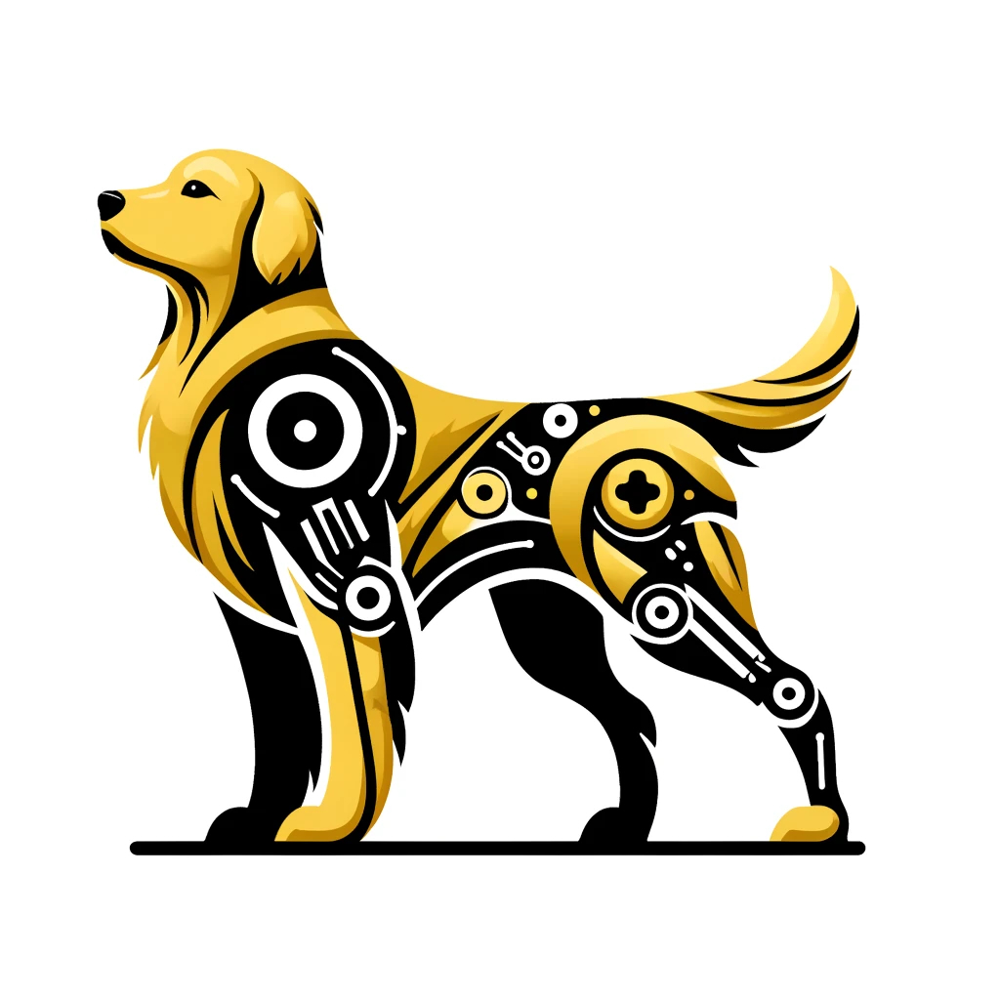
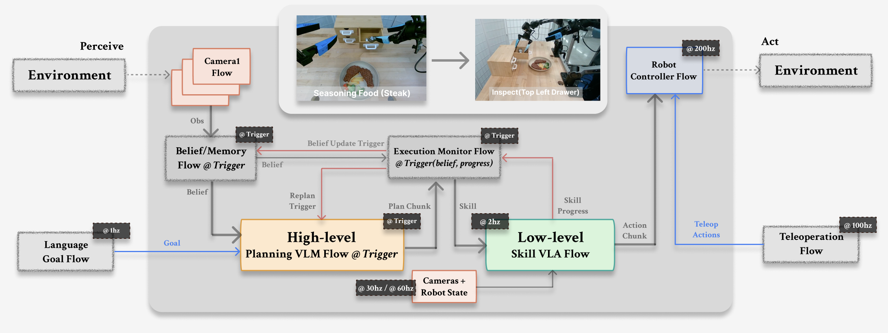
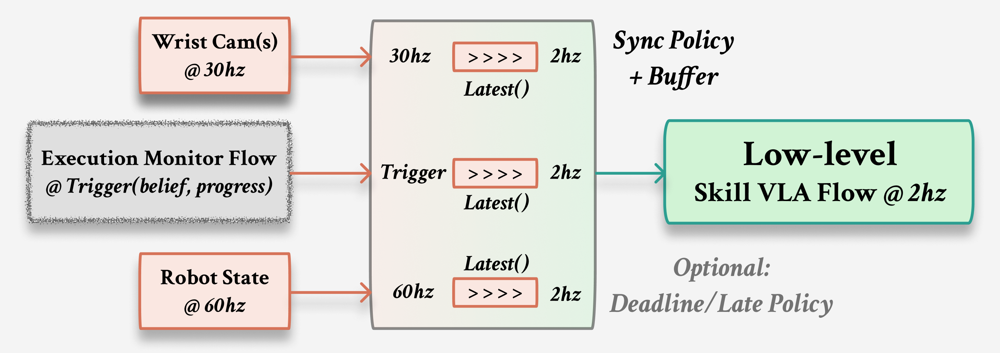

<div class="rt-hero">
  
  <p class="rt-eyebrow">Retriever runtime docs</p>
  <h1>Build robot agents with explicit time.</h1>
  <p class="rt-lede">Retriever is a Python framework for closed-loop robot systems whose perception, reasoning, and control run together at mismatched rates.</p>
  <div class="rt-action-grid">
    <a class="rt-action-card" href="/quickstart/">
      <span class="rt-action-icon">▶</span>
      <strong>Start with webcam detection</strong>
      <small>See live color detections in Rerun, then step the same style of graph locally.</small>
    </a>
    <a class="rt-action-card" href="/tutorials/">
      <span class="rt-action-icon">▣</span>
      <strong>Follow the tutorial path</strong>
      <small>Flow, time, runtime, debugging, sync, and release evidence.</small>
    </a>
    <a class="rt-action-card" href="/examples/">
      <span class="rt-action-icon">◇</span>
      <strong>See visual examples</strong>
      <small>Webcam detection, graph visualization, replay, and Golden reference layer.</small>
    </a>
  </div>
</div>

General-purpose robot agents rarely fit in one clean loop. Cameras stream, robot state updates faster than policies, VLM/VLA calls have variable latency, planners can block, operators intervene, and replay has to explain exactly what happened. Retriever puts those timing and handoff decisions in the program instead of scattering them across callbacks, queues, and sleeps.

<figure class="rt-figure-card rt-figure-wide">
  
  <figcaption>A representative Retriever pipeline: slow reasoning, medium-rate skills, and high-rate control all live in one explicit graph.</figcaption>
</figure>

## Learn By Building

<div class="rt-path-grid">
  <a class="rt-path-step" href="/quickstart/">
    <span>01</span>
    <strong>Run a visual graph</strong>
    <p>Open a webcam, show red/blue objects, and watch detections in Rerun.</p>
    <code>pixi run demo-webcam-detection</code>
  </a>
  <a class="rt-path-step" href="/guide_flow/">
    <span>02</span>
    <strong>Understand the objects</strong>
    <p>Flow, Clock, Sync Policy, and Pipeline are the vocabulary.</p>
    <code>Flow @ Rate → Pipeline.connect</code>
  </a>
  <a class="rt-path-step" href="/guides/debugging/">
    <span>03</span>
    <strong>Debug before backends</strong>
    <p>Step the graph in one process before multiprocessing or dora.</p>
    <code>pipe.step(dt=0.1)</code>
  </a>
  <a class="rt-path-step" href="/tutorials/track_c_debug_and_replay/">
    <span>04</span>
    <strong>Record and replay</strong>
    <p>Turn a transient robot run into a repeatable local artifact.</p>
    <code>pixi run demo-record-replay</code>
  </a>
</div>

## The Four Objects

<div class="rt-concept-grid">
  <a class="rt-concept-card" href="/guide_flow/">
    <h3>Flow</h3>
    <p>A typed Python class with a synchronous <code>step(...)</code> and local state.</p>
  </a>
  <a class="rt-concept-card" href="/guide_temporal/">
    <h3>Clock</h3>
    <p>Each Flow declares when it runs. There is no global robot timestep.</p>
  </a>
  <a class="rt-concept-card" href="/guide_temporal/">
    <h3>Sync Policy</h3>
    <p>Each edge declares how upstream event history is sampled before a Flow runs.</p>
  </a>
  <a class="rt-concept-card" href="/guide_runtime/">
    <h3>Pipeline</h3>
    <p>The closed-loop graph that validates, visualizes, steps, replays, and runs.</p>
  </a>
</div>

<figure class="rt-figure-card rt-figure-wide">
  
  <figcaption>Flows stay simple: the runtime wakes a Flow on its clock, samples each incoming edge with a declared sync policy, then calls <code>step(...)</code> once on one aligned input.</figcaption>
</figure>

## See The Capabilities

<div class="rt-command-grid">
  <div class="rt-command-card"><span>Visual graph</span><strong>Render the pipeline</strong><small>Inspect topology, clocks, ports, and edge policies as an HTML graph.</small><code>pixi run docs-tutorial-perception-html</code></div>
  <div class="rt-command-card"><span>Debugging</span><strong>Step one tick</strong><small>Use normal Python breakpoints and inspect exactly which Flows executed.</small><code>pixi run demo-stepper</code></div>
  <div class="rt-command-card"><span>Replay</span><strong>Record once, debug many times</strong><small>Persist a perception run, then replay the same consumed events.</small><code>pixi run demo-record-replay</code></div>
  <div class="rt-command-card"><span>Backends</span><strong>Run the same graph elsewhere</strong><small>Move from in-process debugging to multiprocessing or dora execution.</small><code>pixi run demo-rt-execution</code></div>
</div>

## First Commands

=== "Shortest path"

    ```bash
    pixi run demo-webcam-detection  # webcam color detection + Rerun
    pixi run demo-basic-flow
    pixi run demo-stepper
    ```

=== "Debug and replay"

    ```bash
    pixi run demo-perception-stepper
    pixi run demo-webcam-record
    pixi run demo-webcam-replay-rrd
    ```

=== "Inspect the graph"

    ```bash
    pixi run demo-ir-validation
    pixi run docs-tutorial-perception-html
    ```

## Documentation Map

<div class="rt-doc-map">
  <a href="/quickstart/"><strong>Quickstart</strong><span>Smallest runnable introduction.</span></a>
  <a href="/tutorials/"><strong>Tutorial Path</strong><span>Ordered builder-facing lessons.</span></a>
  <a href="/guide_flow/"><strong>Concepts</strong><span>Flow, Clock, Sync Policy, Pipeline.</span></a>
  <a href="/guides/debugging/"><strong>Debugging</strong><span>Stepper, traces, recording, replay.</span></a>
  <a href="/handbook/"><strong>Handbook</strong><span>Runtime reference after the basics.</span></a>
  <a href="/examples/"><strong>Examples</strong><span>Core examples and GoldenRetriever boundary.</span></a>
</div>
